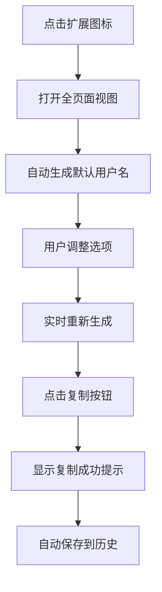
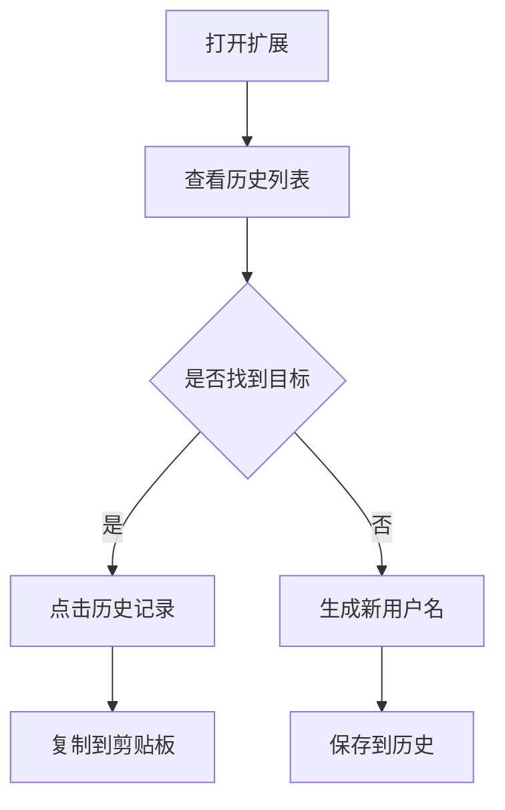

# 产品需求文档 (PRD)
## Username Generator Chrome Extension

---

### 文档信息

| 项目 | 信息 |
|------|------|
| 产品名称 | Username Generator |
| 产品类型 | Chrome 浏览器扩展 |
| 文档版本 | v1.0 |
| 创建日期 | 2026-01-20 |
| 产品负责人 | Product Team |
| 目标平台 | Chrome Browser (Manifest V3) |
| 文档状态 | 已发布 |

---

## 一、产品概述

### 1.1 产品定位

Username Generator 是一款轻量级的 Chrome 浏览器扩展，旨在为用户快速生成**可读性强、易于记忆**的用户名。通过提供多种生成模式和灵活的自定义选项，帮助用户在注册账号、创建测试数据、保护隐私等场景下，高效地获取符合需求的用户名。

### 1.2 核心价值主张

- **智能生成算法**：提供"易发音"、"易阅读"、"全字符"三种模式，满足不同场景需求
- **极致便捷**：一键生成，一键复制，零学习成本
- **历史追溯**：自动记录生成历史，方便回溯和复用
- **隐私优先**：完全离线运行，数据仅存储在本地
- **轻量高效**：无需注册登录，最小化权限请求

### 1.3 产品愿景

成为 Chrome 生态中**最受欢迎的用户名生成工具**，帮助用户在数字世界中快速建立独特且易记的身份标识。

---

## 二、目标用户与场景分析

### 2.1 目标用户画像

#### 主要用户群体

| 用户类型 | 特征描述 | 占比 |
|---------|---------|------|
| **开发者/测试工程师** | 需要大量测试账号和数据，追求效率 | 40% |
| **隐私意识用户** | 在不同平台使用不同用户名保护隐私 | 30% |
| **普通互联网用户** | 注册新账号时缺乏创意，需要灵感 | 20% |
| **游戏玩家** | 需要独特且易记的游戏 ID | 10% |

#### 用户特征

- **年龄分布**：18-45 岁，以技术从业者为主
- **技术水平**：中高级互联网用户
- **使用频率**：低频高价值（平均每周 1-3 次）
- **设备环境**：桌面端 Chrome 浏览器

### 2.2 用户需求与痛点

| 痛点 | 现状 | 影响 | 优先级 |
|------|------|------|--------|
| **命名困难** | 注册账号时缺乏创意，浪费时间思考用户名 | 注册流程中断，用户体验差 | P0 |
| **重名冲突** | 常见用户名已被占用，需要反复尝试 | 降低注册成功率，产生挫败感 | P0 |
| **记忆负担** | 随机生成的用户名难以记忆（如 xK7zQ2pL） | 遗忘用户名，增加找回成本 | P1 |
| **隐私泄露** | 在多个平台使用相同用户名容易被关联追踪 | 隐私风险，信息安全隐患 | P1 |
| **效率低下** | 手动构思用户名耗时，批量生成困难 | 开发测试效率低，时间成本高 | P2 |
| **历史丢失** | 之前生成的满意用户名无法找回 | 重复劳动，降低工具价值 | P2 |

### 2.3 典型使用场景

#### 场景一：开发者创建测试账号

**场景描述**：
张工是一名后端开发工程师，正在测试用户注册模块，需要创建 50 个测试账号来验证功能。

**用户路径**：
1. 点击浏览器工具栏的 Username Generator 图标
2. 选择"易于阅读"模式（避免混淆字符）
3. 设置长度为 10 个字符
4. 连续点击"Generate Username"生成多个用户名
5. 点击"Copy Username"复制到测试表单
6. 从历史记录中查看和复制之前生成的用户名

**期望结果**：
- 5 分钟内完成 50 个测试账号的创建
- 用户名清晰可辨，便于调试时识别
- 历史记录便于回溯和问题排查

#### 场景二：隐私用户注册新平台

**场景描述**：
李女士是隐私意识较强的互联网用户，希望在新的社交平台上使用不同于其他平台的用户名。

**用户路径**：
1. 在注册页面时打开 Username Generator
2. 选择"易于发音"模式（便于向朋友介绍）
3. 勾选"小写字母"和"数字"
4. 调整长度为 8-12 字符
5. 多次生成直到找到满意的用户名
6. 一键复制并粘贴到注册表单

**期望结果**：
- 生成的用户名独特且易记
- 不包含特殊符号（平台可能不支持）
- 避免与现有账号关联

#### 场景三：游戏玩家创建角色

**场景描述**：
王同学想在新游戏中创建一个响亮的游戏 ID，既要有个性又要容易记住。

**用户路径**：
1. 打开 Username Generator 全页面视图
2. 切换不同模式寻找灵感
3. 调整大小写、数字、符号组合
4. 在历史记录中对比多个候选方案
5. 选择最满意的用户名复制使用

**期望结果**：
- 用户名具有辨识度和个性
- 符合游戏平台的命名规则
- 朋友间易于传播

---

## 三、产品功能需求

### 3.1 功能架构图

```
Username Generator
├── 用户名生成引擎
│   ├── 易于发音模式（辅音/元音交替）
│   ├── 易于阅读模式（去除易混淆字符）
│   └── 全字符模式（完全随机）
├── 自定义选项
│   ├── 字符类型（大写/小写/数字/符号）
│   ├── 长度控制（3-30 字符）
│   └── 双向同步（输入框 ↔ 滑块）
├── 历史记录管理
│   ├── 本地存储（最多 50 条）
│   ├── 时间戳记录
│   ├── 懒加载显示
│   ├── 去重与置顶
│   ├── 单条删除
│   └── 全部清空
└── 交互功能
    ├── 一键生成
    ├── 一键复制
    ├── 实时预览
    └── 模式说明提示
```

### 3.2 核心功能详细说明

#### 功能 1：智能生成引擎

**功能描述**：
提供三种生成模式，满足不同场景下对用户名可读性、可发音性、复杂度的差异化需求。

**功能优先级**：P0（核心功能）

**详细需求**：

| 子功能 | 说明 | 规则 | 示例 |
|--------|------|------|------|
| **易于发音** | 辅音-元音交替模式 | - 辅音：bcdfghjklmnpqrstvwxyz<br>- 元音：aeiou<br>- 按 C-V-C-V... 模式排列<br>- 默认启用大小写，禁用数字符号 | `colistes`<br>`Riqotas`<br>`muvekafu` |
| **易于阅读** | 去除易混淆字符 | - 移除字符：I, l, 1, O, 0, S, 5, B, 8, Z, 2<br>- 确保每种字符类型至少出现一次<br>- 默认启用大小写和数字 | `A9k7Thx6`<br>`P4rGn3Ew` |
| **全字符** | 完全随机组合 | - 使用所有选中的字符集<br>- 确保每种字符类型至少出现一次<br>- 随机打乱顺序<br>- 默认启用全部字符类型 | `k7!Qm@2P`<br>`X#9cL%4v` |

**技术实现要点**：
- 使用 `window.crypto.getRandomValues()` 提供加密级随机数（安全性）
- 降级方案：不支持时使用 `Math.random()`
- 字符集预处理：根据选项动态构建可用字符池
- 防重复逻辑：确保每个字符类型至少出现一次

**交互规则**：
1. 模式切换时自动调整复选框状态（预设方案）
2. 任何选项改变时自动重新生成用户名
3. 如果取消所有字符类型，自动回退到小写字母

#### 功能 2：长度控制

**功能描述**：
允许用户精确控制用户名长度，提供输入框和滑块两种交互方式，双向实时同步。

**功能优先级**：P0（核心功能）

**详细需求**：

| 组件 | 类型 | 范围 | 默认值 | 行为 |
|------|------|------|--------|------|
| 数字输入框 | `<input type="number">` | 3-30 | 8 | - 输入时自动钳制到有效范围<br>- 触发滑块同步<br>- 触发用户名重新生成 |
| 范围滑块 | `<input type="range">` | 3-30 | 8 | - 拖动时同步到输入框<br>- 实时触发生成 |

**边界处理**：
- 输入 < 3：自动修正为 3
- 输入 > 30：自动修正为 30
- 非数字输入：回退到默认值 8
- 空值：回退到默认值 8

**用户反馈**：
- 长度改变时立即在显示区域看到对应长度的用户名
- 输入框和滑块保持视觉同步

#### 功能 3：历史记录管理

**功能描述**：
自动保存用户生成的用户名历史，支持查看、复制、删除操作，提供时间追溯能力。

**功能优先级**：P1（重要功能）

**详细需求**：

| 子功能 | 说明 | 规则 |
|--------|------|------|
| **自动保存** | 每次生成时自动保存 | - 存储在 `chrome.storage.local`<br>- 包含用户名和时间戳<br>- 初始自动生成也保存 |
| **容量限制** | 最多保存 50 条 | - 超过 50 条时删除最旧的记录<br>- FIFO（先进先出）策略 |
| **去重逻辑** | 相同用户名去重 | - 如果用户名已存在，更新时间戳<br>- 移动到列表顶部（最新） |
| **时间戳** | 精确到秒 | - 格式：YYYY-MM-DD HH:mm:ss<br>- 使用本地时区<br>- 按时间倒序排列 |
| **懒加载** | 分批加载显示 | - 初始显示 10 条<br>- 滚动到底部或点击"Load more"加载下一批<br>- 每批加载 10 条 |
| **点击复制** | 点击历史项复制 | - 单击历史记录条目<br>- 复制用户名到剪贴板<br>- 显示提示"Username copied to clipboard!" |
| **单条删除** | 删除指定记录 | - 点击记录右侧的"✕"按钮<br>- 从历史中移除该条记录<br>- 阻止事件冒泡（不触发复制） |
| **全部清空** | 清空所有历史 | - 点击"Clear all"按钮<br>- 清空所有历史记录<br>- 显示空状态提示 |

**数据结构**：
```javascript
{
  "usernameHistory": [
    {
      "username": "colistes",
      "timestamp": 1737350417000
    },
    // ... 最多 50 条
  ]
}
```

**界面状态**：
- **空状态**：显示 "No usernames yet. Generate one to get started."
- **有数据**：显示历史列表
- **加载更多按钮**：当还有未显示的记录时可点击，否则禁用

#### 功能 4：一键复制

**功能描述**：
提供多个复制入口，确保用户能快速将生成的用户名复制到剪贴板。

**功能优先级**：P0（核心功能）

**详细需求**：

| 复制入口 | 触发方式 | 反馈 |
|---------|---------|------|
| 主复制按钮 | 点击"Copy Username"按钮 | Alert 提示 |
| 历史记录项 | 点击历史记录条目 | Alert 提示 |

**技术实现**：
- 使用 `navigator.clipboard.writeText()` API
- 复制成功：显示 `alert("Username copied to clipboard!")`
- 复制失败：显示 `alert("Copy failed. Please try again.")`，并在控制台记录错误

**权限要求**：
- 无需显式声明 `clipboardWrite` 权限（MV3 中用户手势触发时自动授予）

### 3.3 辅助功能

#### 功能 5：模式说明提示

**功能描述**：
为每种生成模式提供悬停提示，帮助用户理解各模式的特点。

**功能优先级**：P2（加分项）

**详细内容**：

| 模式 | 提示文案 |
|------|---------|
| 易于发音 | Avoid numbers and special characters |
| 易于阅读 | Avoid ambiguous characters like I, l, 1, O, 0, S, 5, B, 8, Z, and 2 |
| 全字符 | Any character combinations like !, 7, h, K, and l1 |

**交互方式**：
- 鼠标悬停在"i"图标上显示提示
- 使用 HTML `title` 属性实现

#### 功能 6：全页面视图

**功能描述**：
点击扩展图标时在新标签页打开完整 UI，而非传统的小弹窗。

**功能优先级**：P1（重要功能）

**优势**：
- 更大的显示空间
- 更舒适的操作体验
- 历史记录列表有足够的显示区域
- 适合批量生成场景

**技术实现**：
- `background.js` 监听 `chrome.action.onClicked` 事件
- 调用 `chrome.tabs.create()` 打开 `page.html`

---

## 四、非功能需求

### 4.1 性能要求

| 指标 | 目标值 | 说明 |
|------|--------|------|
| **页面加载时间** | < 200ms | 从点击图标到页面可交互 |
| **生成响应时间** | < 50ms | 从点击生成按钮到用户名显示 |
| **历史加载时间** | < 100ms | 从存储读取历史到渲染完成 |
| **扩展包大小** | < 100KB | 压缩后的 ZIP 文件大小 |
| **内存占用** | < 5MB | 运行时内存占用 |

### 4.2 兼容性要求

| 项目 | 要求 |
|------|------|
| **浏览器版本** | Chrome 88+ (支持 Manifest V3) |
| **操作系统** | Windows / macOS / Linux / Chrome OS |
| **屏幕分辨率** | 最小 1024x768 |
| **语言** | 界面英文，文档支持中英粤 |

### 4.3 安全性要求

| 需求 | 实现方式 |
|------|---------|
| **最小权限原则** | 仅请求 `storage` 权限 |
| **数据隐私** | 所有数据仅存储在用户本地，不上传服务器 |
| **安全随机数** | 优先使用 `crypto.getRandomValues()` |
| **XSS 防护** | 所有用户输入经过验证和转义 |
| **CSP 合规** | 遵守 Chrome MV3 内容安全策略 |

### 4.4 可用性要求

| 需求 | 标准 |
|------|------|
| **学习成本** | 新用户 30 秒内完成首次生成 |
| **操作效率** | 单次生成+复制操作 < 3 秒 |
| **错误容忍** | 所有边界输入自动修正，不阻断流程 |
| **无障碍** | 支持键盘导航，ARIA 属性标注 |

### 4.5 可维护性要求

| 需求 | 实现方式 |
|------|---------|
| **代码规范** | ES2015+，4 空格缩进，单引号 |
| **测试覆盖** | 核心逻辑单元测试覆盖率 > 80% |
| **文档完整** | README、PRD、OpenSpec 文档齐全 |
| **版本管理** | Git 管理，语义化版本号 |

---

## 五、用户体验设计

### 5.1 界面布局

```
┌─────────────────────────────────────────────────────┐
│  [Icon] Username Generator                          │
│  Chrome Extension                                   │
│  Customize a readable username, sync length         │
│  controls, and copy with one click.                 │
├─────────────────────────────────────────────────────┤
│                                                     │
│         ┌─────────────────────────┐                │
│         │    c0lISTES             │  ← 生成结果    │
│         └─────────────────────────┘                │
│                                                     │
│  Customize your username                           │
│                                                     │
│  ○ Easy to say      [i]    □ Uppercase            │
│  ○ Easy to read     [i]    ☑ Lowercase            │
│  ○ All characters   [i]    □ Numbers              │
│                            □ Symbols              │
│                                                     │
│  Username Length: [8] [━━━●━━━━━━] 3─────30       │
│                                                     │
│  [Generate Username]  [Copy Username]             │
│                                                     │
│  ────────────────────────────────────────────      │
│                                                     │
│  History          Recent usernames  [Clear all]    │
│                                     [Load more]    │
│  ┌───────────────────────────────────────────┐    │
│  │ colistes             2026-01-20 11:25:30  │[✕] │
│  │ muvekafu             2026-01-20 11:25:15  │[✕] │
│  │ Riqotas              2026-01-20 11:24:58  │[✕] │
│  │ ...                                        │    │
│  └───────────────────────────────────────────┘    │
└─────────────────────────────────────────────────────┘
```

### 5.2 交互流程

#### 流程 1：首次使用



#### 流程 2：从历史复制



### 5.3 视觉设计原则

| 原则 | 说明 |
|------|------|
| **清晰易读** | 使用大号字体显示生成结果，确保一眼可见 |
| **分组明确** | 模式选择、字符选项、长度控制、历史记录分区明显 |
| **反馈及时** | 所有操作都有即时视觉反馈 |
| **色彩克制** | 主要使用中性色，强调关键按钮 |
| **留白适度** | 保持界面呼吸感，避免拥挤 |

---

## 六、技术实现方案

### 6.1 技术栈选型

| 技术 | 选择 | 理由 |
|------|------|------|
| **扩展标准** | Manifest V3 | Chrome 官方推荐，未来趋势 |
| **前端框架** | 原生 JavaScript | 轻量、快速、零依赖 |
| **样式方案** | 原生 CSS | 充分控制，无构建步骤 |
| **存储方案** | chrome.storage.local | 官方 API，跨设备同步潜力 |
| **测试框架** | Jest + jsdom | 主流选择，生态完善 |

### 6.2 核心模块设计

```
popup.js (核心逻辑)
├── 常量定义
│   ├── 字符集（大小写、数字、符号、元音、辅音）
│   ├── 易混淆字符模式
│   └── 历史记录配置
├── DOM 元素引用
├── 工具函数
│   ├── clampLength()           # 长度钳制
│   ├── syncLengthInputs()      # 输入同步
│   ├── getRandomIndex()        # 安全随机数
│   ├── pickChar()              # 随机选字符
│   └── shuffleArray()          # 数组打乱
├── 生成引擎
│   ├── buildCharacterSets()    # 构建字符集
│   ├── buildPronounceableSets() # 构建发音集
│   ├── generatePronounceableUsername() # 发音模式
│   ├── resolveSelectedCategories() # 解析选项
│   └── generateUsername()      # 主生成函数
├── 历史管理
│   ├── formatTimestamp()       # 时间格式化
│   ├── upsertHistory()         # 去重插入
│   ├── persistHistory()        # 持久化
│   ├── loadHistory()           # 加载历史
│   ├── renderHistory()         # 渲染列表
│   └── addHistoryEntry()       # 添加记录
└── 事件处理
    ├── 长度输入事件
    ├── 模式切换事件
    ├── 生成/复制按钮
    ├── 历史操作事件
    └── 初始化逻辑
```

### 6.3 数据流设计

```
用户操作 → 收集选项 → 生成用户名 → 更新 DOM → 保存历史 → 持久化存储
   ↑                                                              ↓
   └──────────────────── 初始化加载 ←──────────────────────────────┘
```

### 6.4 关键算法伪代码

#### 易于发音生成算法

```javascript
function generatePronounceableUsername(length, options) {
  vowels = options.uppercase ? "AEIOU" : "aeiou"
  consonants = options.uppercase ? "BCDFG..." : "bcdfg..."
  
  result = []
  for i in 0..length-1:
    if i is even:
      result.push(randomChar(consonants))
    else:
      result.push(randomChar(vowels))
  
  return result.join("")
}
```

#### 历史去重算法

```javascript
function upsertHistory(list, entry, limit) {
  // 1. 移除已有重复项
  filtered = list.filter(item => item.username != entry.username)
  
  // 2. 新记录插入顶部
  filtered.unshift(entry)
  
  // 3. 按时间倒序排列
  filtered.sort((a, b) => b.timestamp - a.timestamp)
  
  // 4. 限制最大数量
  return filtered.slice(0, limit)
}
```

---

## 七、数据指标与成功标准

### 7.1 核心指标（North Star Metrics）

| 指标名称 | 定义 | 目标值 | 数据来源 |
|---------|------|--------|---------|
| **DAU** | 日活跃用户数 | 1000+ | Chrome Web Store |
| **使用频率** | 平均每用户每周生成次数 | 3+ | 内部统计 |
| **留存率** | 7 日留存率 | 40%+ | Chrome Analytics |
| **评分** | Chrome 商店评分 | 4.5+ | 用户评价 |

### 7.2 功能指标

| 功能 | 指标 | 目标 |
|------|------|------|
| 生成功能 | 单次使用平均生成次数 | 2-5 次 |
| 历史记录 | 历史点击复制占比 | 30%+ |
| 模式分布 | 各模式使用占比 | 易发音 40% / 易阅读 35% / 全字符 25% |
| 长度分布 | 最常用长度范围 | 8-12 字符 |

### 7.3 质量指标

| 维度 | 指标 | 目标 |
|------|------|------|
| **性能** | 页面加载时间 P95 | < 300ms |
| **稳定性** | Crash Free Rate | 99.9% |
| **错误率** | 复制失败率 | < 0.1% |
| **测试覆盖** | 单元测试覆盖率 | > 80% |

---

## 八、发布与迭代计划

### 8.1 版本规划

#### v1.0（当前版本）- MVP

**发布时间**：2026-01-20

**核心功能**：
- ✅ 三种生成模式
- ✅ 字符类型自定义
- ✅ 长度控制
- ✅ 一键复制
- ✅ 历史记录（最多 50 条）
- ✅ 全页面视图

#### v1.1（计划中）- 体验优化

**预计时间**：2026 Q1

**优化重点**：
- [ ] 添加快捷键支持（Ctrl/Cmd + G 生成，Ctrl/Cmd + C 复制）
- [ ] 历史记录搜索/过滤功能
- [ ] 支持导出历史记录为 CSV
- [ ] 添加收藏功能（标记常用用户名）
- [ ] 深色模式支持
- [ ] 多语言界面（中文、日文）

#### v1.2（远期规划）- 高级特性

**预计时间**：2026 Q2

**新增功能**：
- [ ] 自定义生成规则（正则表达式模式）
- [ ] 批量生成（一次生成 10 个候选）
- [ ] 用户名可用性检查（集成第三方 API）
- [ ] 云端同步历史记录（需用户授权）
- [ ] 词库模式（基于自然语言组合）
- [ ] Chrome Sync 存储支持

### 8.2 发布检查清单

#### 功能测试

- [ ] 所有生成模式正常工作
- [ ] 长度边界处理正确（3, 30, 非法值）
- [ ] 历史记录去重逻辑验证
- [ ] 复制功能在各浏览器版本可用
- [ ] 存储读写无错误

#### 兼容性测试

- [ ] Chrome 最新版本
- [ ] Chrome 88（最低版本）
- [ ] Windows / macOS / Linux
- [ ] 不同屏幕分辨率

#### 性能测试

- [ ] 页面加载时间 < 200ms
- [ ] 连续生成 100 次无卡顿
- [ ] 历史记录 50 条加载 < 100ms
- [ ] 内存泄漏检查

#### 安全测试

- [ ] 权限声明最小化
- [ ] 无网络请求
- [ ] 代码无 eval 或 inline script

#### 文档完善

- [ ] README 更新
- [ ] PRD 撰写
- [ ] 用户手册
- [ ] 开发文档

---

## 九、风险与应对

### 9.1 技术风险

| 风险 | 影响 | 概率 | 应对措施 |
|------|------|------|---------|
| **Manifest V3 政策变更** | 高 | 中 | 持续关注 Chrome 官方文档，及时适配 |
| **存储容量限制** | 中 | 低 | 限制历史 50 条，提供导出功能 |
| **浏览器兼容性** | 中 | 低 | 遵循 Web 标准，避免实验性 API |
| **随机数质量** | 低 | 极低 | 优先使用 crypto API，已有降级方案 |

### 9.2 产品风险

| 风险 | 影响 | 概率 | 应对措施 |
|------|------|------|---------|
| **用户需求不匹配** | 高 | 中 | 小范围内测，收集反馈迭代 |
| **竞品冲击** | 中 | 中 | 持续优化体验，建立差异化优势 |
| **用户粘性不足** | 中 | 中 | 优化历史记录功能，提高回访价值 |
| **推广困难** | 中 | 高 | 撰写技术博客，开源社区推广 |

### 9.3 运营风险

| 风险 | 影响 | 概率 | 应对措施 |
|------|------|------|---------|
| **负面评价** | 高 | 低 | 快速响应用户反馈，及时修复 Bug |
| **隐私质疑** | 高 | 低 | 明确声明无数据上传，开源代码 |
| **维护成本** | 中 | 中 | 代码规范化，文档完善，降低维护门槛 |

---

## 十、附录

### 10.1 术语表

| 术语 | 定义 |
|------|------|
| **Manifest V3** | Chrome 扩展第三代清单文件标准，强调安全性和性能 |
| **易混淆字符** | 视觉上容易混淆的字符，如 I/l/1（大写 i/小写 L/数字 1） |
| **辅音/元音交替** | 按辅音-元音-辅音-元音的模式组合字符，提高可发音性 |
| **懒加载** | 按需分批加载数据，提升初始渲染性能 |
| **去重逻辑** | 相同数据只保留一份，避免重复记录 |
| **chrome.storage.local** | Chrome 扩展本地存储 API，数据存储在用户设备 |

### 10.2 参考资料

- [Chrome Extension Manifest V3 官方文档](https://developer.chrome.com/docs/extensions/mv3/)
- [Chrome Storage API 文档](https://developer.chrome.com/docs/extensions/reference/storage/)
- [Web Crypto API 文档](https://developer.mozilla.org/en-US/docs/Web/API/Web_Crypto_API)
- [Jest 测试框架文档](https://jestjs.io/)

### 10.3 变更记录

| 版本 | 日期 | 作者 | 变更说明 |
|------|------|------|---------|
| v1.0 | 2026-01-20 | Product Team | 初始版本发布 |

---

**文档结束**

如有疑问或建议，请联系产品团队。
